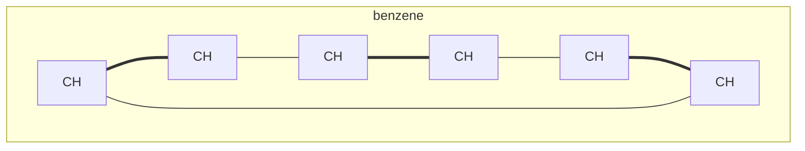
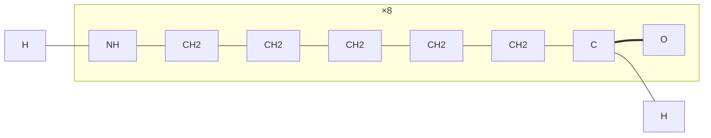
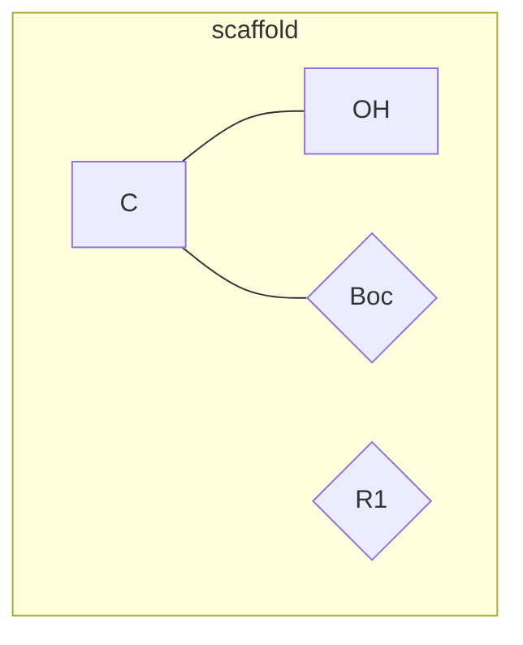
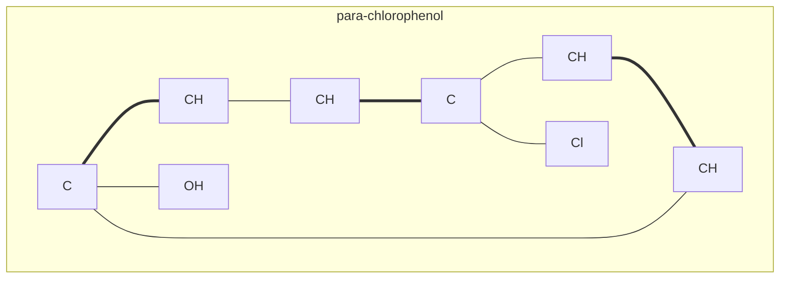

# MoleCode Full Syntax

Complete reference for authoring and parsing MoleCode graphs across all domains.
For a quick small-molecule cheat-sheet, read `molecode-syntax.md` first.

## Table of contents

1. [Document forms](#document-forms)
2. [Atom nodes](#atom-nodes)
3. [Bond edges](#bond-edges)
4. [Aromaticity](#aromaticity)
5. [Stereochemistry](#stereochemistry)
6. [Multi-subgraph molecules and reactions](#multi-subgraph-molecules-and-reactions)
7. [Polymers](#polymers)
8. [Markush structures](#markush-structures)
9. [Validation checklist](#validation-checklist)
10. [Worked examples](#worked-examples)

## Document forms

Every MoleCode document is a Mermaid graph opened by `graph TB` (top-bottom) or
`graph LR` (left-right), containing one or more `subgraph ID["name"] … end`
blocks. The three structural domains use the same primitives:

- **Small molecule** — one or more subgraphs of atom nodes + bond edges.
- **Polymer** — a repeat-unit subgraph labelled `["×n"]` with `TL` / `TR`
  terminus markers (see [Polymers](#polymers)).
- **Markush** — atom subgraphs that also contain `{abbreviation}` nodes (see
  [Markush](#markush-structures)).

`%%` begins a comment; the parser ignores it. Comments are the place to attach
reasoning, atom inventories, and validation notes inline.

## Atom nodes

Format: `prefix_Element_Number[DisplayLabel]`, optionally with a chirality suffix
`prefix_Element_Number_R[...]`.

- **prefix** — stable namespace (molecule/subgraph name), keeps ids unique.
- **Element_Number** — element symbol + per-element counter; the persistent id.
- **DisplayLabel** — element + explicit hydrogen count + formal charge.

| Label | Meaning | Label | Meaning |
| --- | --- | --- | --- |
| `[CH3]` | C, 3 H | `[N(+)]` | N, charge +1 |
| `[CH2]` | C, 2 H | `[O(-)]` | O, charge −1 |
| `[CH]` | C, 1 H | `[NH3(+)]` | ammonium |
| `[C]` | C, 0 H | `[O(2-)]` | oxide, −2 |
| `[OH]`, `[NH2]`, `[Cl]` | … | | |

Hydrogen counts are explicit — keep them consistent with valence whenever you add
or remove a bond. The element symbol in the id must match the label
(`mol_O_1[OH]`, never `mol_OH_1[OH]`).

## Bond edges

`node_a <operator> node_b`, where both ids are declared atom nodes:

| Operator | Bond | RDKit |
| --- | --- | --- |
| `---` | single | SINGLE |
| `===` | double | DOUBLE |
| `-.-` | triple | TRIPLE |
| `-->` | dative / coordinate | DATIVE |
| `<-->` | aromatic | AROMATIC |

## Aromaticity

For small molecules, write aromatic rings in **Kekulé form** — explicit
alternating `===` and `---` around the ring — so topology is unambiguous:

The converters also accept explicit aromatic `<-->` edges (use the
`--no-kekulize` export option to emit them). The markush isomorphism comparator
treats Kekulé and aromatic forms as equivalent.

## Stereochemistry

- **Double-bond E/Z** — annotate the double bond:
  `but2ene_C_2 ===|E| but2ene_C_3` (also `===|Z|`).
- **Tetrahedral chirality** — append the **absolute CIP** label `_R` / `_S` to the
  atom id: `mol_C_2_R[CH]`. This is the CIP configuration, not RDKit's
  order-dependent CW/CCW tag.

Both round-trip through SMILES (and PSMILES for polymers).

## Multi-subgraph molecules and reactions

A molecule may be split into several chemically meaningful subgraphs; bonds can
cross subgraph boundaries by referencing ids in different subgraphs. This is also
how to lay out a **reaction**: give each species (reactant, intermediate,
product) its own subgraph, keep atom ids stable across steps so atoms can be
tracked, and use `%%` comments to describe the transformation. The bundled script
converts a single molecule subgraph set; multi-species reaction graphs are an
authoring/analysis pattern rather than a single CLI conversion.

## Polymers

Represent a polymer by its **repeat unit**, kept explicit, with the repetition
count carried symbolically in the subgraph label `["×n"]` and two terminus
markers `TL` / `TR` standing for the two `*` attachment atoms of the PSMILES.

- `TL --- {entry}` marks the left attachment (first `*`); `{exit} --- TR` the
  right (second `*`).
- Block copolymers use one subgraph per block in order, joined
  `B0_exit --- B1_entry`.
- R/S and E/Z stereochemistry in the repeat unit round-trips
  (`*C/C=C/C*` trans vs `*C/C=C\C*` cis stay distinct).

## Markush structures

Markush / generic structures add **abbreviation nodes** in curly braces
`{label}` alongside `[atom]` nodes:

- `Mol_X_1{Boc}` — a named group left unexpanded; `Mol_X_2{R1}` — a variable
  group with no fixed structure.
- Each `{}` holds exactly one chemically meaningful abbreviation. Decompose a
  composite like `NHBoc` into `[NH] --- {Boc}`.
- Common: `{Me}`, `{Et}`, `{Ph}`, `{Bn}`, `{Boc}`, `{Cbz}`, `{Ts}`, `{NO2}`,
  `{COOH}`, `{CF3}`, `{OMe}`, `{tBu}`; variables: `{R}`, `{R1}`…`{R17}`, `{Ar}`,
  `{X}`, `{Y}`, `{Alkyl}`, `{(CH2)n}`.
- `compare` scores two graphs up to abbreviation expansion and Kekulé ambiguity:
  `{Me}` ≡ `{CH3}`, and `{Boc}` ≡ a fully drawn t-butyl carbamate.

## Validation checklist

- Every bond references two declared atom-node ids.
- Hydrogen counts are consistent with each atom's bonds.
- The element in each id matches its label.
- Aromatic rings are Kekulé (or deliberately `<-->`).
- Stereo labels (`===|E/Z|`, `_R`/`_S`) are present where required.
- `validate` reports the expected formula / atom & ring counts, and
  `round_trip_ok: True`.

## Worked examples

### Ethanol → propan-1-ol (add a methyl, with H bookkeeping)

Start: `Ethanol_C_1[CH3] --- Ethanol_C_2[CH2] --- Ethanol_O_1[OH]`.
Edit: relabel `Ethanol_C_1` to `[CH2]` (it gains a bond), add `Ethanol_C_3[CH3]`
and the edge `Ethanol_C_1 --- Ethanol_C_3`. Result SMILES: `CCCO`.

### Para-chlorophenol (Kekulé ring + substituents)

