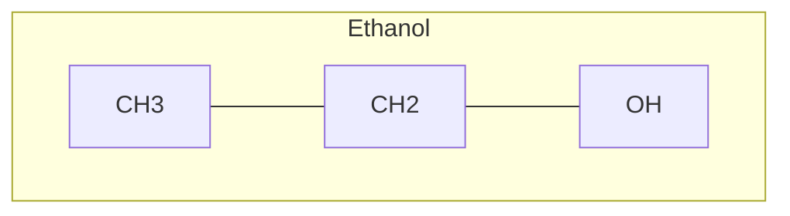

# MoleCode Syntax (compact)

Use this when manually writing or editing a small-molecule MoleCode graph. For
polymers, Markush, stereochemistry, multi-subgraph molecules and reactions, read
`molecode-syntax-full.md`.

## Editing model

A MoleCode graph exposes a molecule as code: a list of **atom nodes** and a list
of **bond edges**. Read both to reconstruct the full topology before editing.
Most SMILES editing tasks become local graph edits — change an atom label, add or
remove a node, add or remove an edge — instead of rewriting a string. Treat a
`.mmd` file like source code: inspect diffs, patch specific lines, add concise
`%%` comments, and convert back to SMILES only after the graph is correct.

## Document shape

- `graph TB` (or `graph LR`) opens the document.
- A `subgraph ID["name"] … end` block scopes one structural object. Bonds may
  cross subgraphs.
- `%%` begins a comment, ignored by the parser.

## Atom nodes

Format: **`prefix_Element_Number[DisplayLabel]`**

- `prefix` — a stable namespace, usually the molecule/subgraph name.
- `Element_Number` — element symbol + a per-element counter → a persistent id
  (`C_1`, `C_2`, `O_1`).
- `[DisplayLabel]` — element + explicit hydrogen count + charge:
  `[CH3]`, `[CH2]`, `[CH]`, `[C]`, `[OH]`, `[NH2]`, `[N(+)]`, `[O(-)]`, `[O(2-)]`.

**Hydrogen counts are explicit.** When you add a bond to an atom, decrement its H
count to keep valence correct: bonding onto `[CH3]` makes it `[CH2]`.

## Bond edges

| Operator | Bond |
| --- | --- |
| `---` | single |
| `===` | double |
| `-.-` | triple |
| `-->` | dative / coordinate |
| `<-->` | aromatic (non-Kekulé) |

Every edge is `node_a <op> node_b`, where both ids already exist as atom nodes.
Aromatic rings are normally written in **Kekulé form** (alternating `===`/`---`).

## Stereochemistry

- Double-bond E/Z: `EB_C_2 ===|E| EB_C_3` (also `===|Z|`).
- Chirality: append absolute CIP `_R` / `_S` to the atom id, e.g.
  `mol_C_2_R[CH]`.

## Validation workflow

1. Convert the source molecule with `smiles-to-molecode`.
2. Edit atom labels and bond edges; avoid renaming ids unless necessary.
3. Run `validate` to check formula, atom/ring counts, and round-trip.
4. Convert to SMILES with `molecode-to-smiles`.

## Frequent errors

- Adding a bond without decrementing the atom's hydrogen count.
- Referencing a node id in a bond that is not declared as an atom node.
- Putting the element count in the label instead of the id
  (`mol_OH_1[OH]` → use `mol_O_1[OH]`).
- Writing an aromatic ring with `<-->` when the converter expects Kekulé form
  (use `--no-kekulize` if you deliberately want aromatic bonds).
