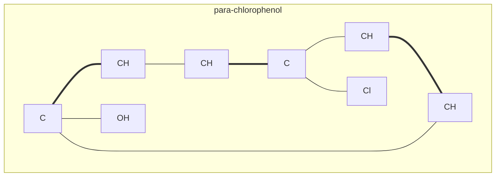
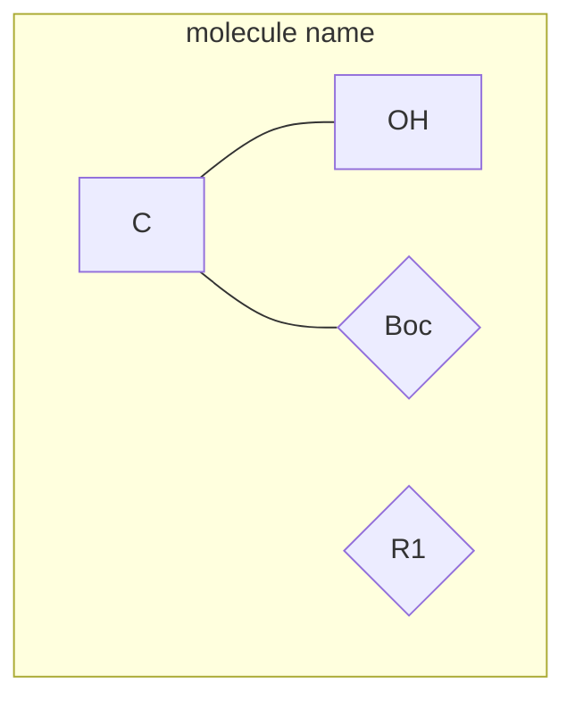

<div align="center">

# 🧬 MoleCode

### 一种面向大语言模型、显式表达分子图的分子语言

**从分子字符串到结构化代码:让大语言模型直接在化学结构上操作。**

*不要再让语言模型从晦涩的字符串里还原分子结构——让它直接读取、书写并编辑结构。*

[](https://arxiv.org/abs/2605.16480)
[](https://arxiv.org/pdf/2605.16480)
[](https://atomflow-ai.com/)
[](https://github.com/AtomFlow-AI/MoleCode)
<br>[](LICENSE)
[](https://www.python.org/)
[](https://www.rdkit.org/)
<br>[](.claude/skills/molecode/)
[](AGENTS.md)
[](.claude/skills/molecode/SKILL.md)

[English](README.md) | **中文**

<br>
<br>


</div>

---

## 欢迎试用我们的最新产品!
请移步 [AtomFlow 官网](https://atomflow-ai.com/).

<p align="center">
  
  
  
</p>

<br>

## MoleCode 是什么?

分子**本质上就是一张图**:原子是节点,化学键是边,化学性质由拓扑结构决定。然而大语言模型拿到的分子几乎总是 SMILES 这样的*线性字符串*,其中的图是**隐式的**——连接关系靠位置表达,支链靠语法表达,环则藏在索引数字里。在做任何化学推理之前,模型必须先*从语法中重建出分子图*,把推理预算耗在结构记账上。

**MoleCode 让结构本身成为语言。** 每个原子和化学键都被写成带持久标识符的、有类型的声明,并序列化为一张 [Mermaid](https://mermaid.js.org/) 图。拓扑结构在上下文窗口内变得可直接读取、编辑和审计——并且这种格式可以通过 RDKit **确定性、无损地与 SMILES / MOL 互相转换**(不依赖任何训练模型,不丢失信息)。



> 同一套 `子图 → 节点 → 边`(Subgraph → Node → Edge)文法覆盖**小分子、聚合物和马库什(Markush)结构**——并可进一步扩展到反应机理和多模态文档解析。

---

## 为什么重要

| | SMILES | **MoleCode** |
| --- | --- | --- |
| 拓扑结构 | 隐式、靠位置 | **显式、带命名的节点与边** |
| 原子身份 | 无 | **持久标识符**(在提示 → 推理 → 输出全程稳定) |
| 编辑方式 | 整串重写 | **局部图操作**(加一个甲基 = 1 个节点 + 1 条边) |
| 校验方式 | 脆弱的字符串解析 | **确定性的 RDKit 往返** |
| 推理行为 | 记忆语法 | **在结构层面泛化** |

实验结论(见 [MoleCode 论文](#-引用) 与 [docs/06-why-it-works.md](docs/06-why-it-works.md)):

- **是泛化,而非记忆。** SMILES 在常见分子上约 42% 的准确率,到陌生分子骤降到约 20%;MoleCode 在所有熟悉度分层上都稳定保持 **~76–80%**。
- **推理更便宜。** MoleCode 的*输入*更长,但其思维链(chain-of-thought)随分子规模**亚线性**增长(~C^0.52),而 SMILES 是超线性的 ~C^1.65——单次查询总 token 成本约**降低 5 倍**。
- **越大越重复,优势越明显。** 随聚合物链增长,整链 SMILES 的准确率趋向 **0%**;MoleCode 基本持平。
- **马库什理解能力**从 **38.1% → 84.0%**。

---

## 安装

```bash
pip install molecode          # 从 PyPI 安装 — 会自动带上 rdkit + networkx
```

或从源码安装(需要 examples、Agent Skill 或参与开发时):

```bash
git clone https://github.com/AtomFlow-AI/MoleCode.git
cd MoleCode
pip install -e .
```

> `pip install molecode` 装的是**库**(`molecode.molecule`、`molecode.polymer`、
> `molecode.markush`、`molecode.prompts`、`molecode.llm`)。可运行的
> [`examples/`](examples) 和 [Agent Skill](.claude/skills/molecode/) 在仓库里。
> 完整 API 速查 → [docs/api.md](docs/api.md)。

## 快速上手

```python
from rdkit import Chem
from molecode import mol_to_mermaid, mermaid_to_mol, mol_to_smiles

# SMILES  ->  MoleCode 图
graph = mol_to_mermaid(Chem.MolFromSmiles("CC(=O)Oc1ccccc1C(=O)O"), name="Aspirin")
print(graph)

# MoleCode 图  ->  SMILES (无损往返)
assert mol_to_smiles(mermaid_to_mol(graph)) == Chem.CanonSmiles("CC(=O)Oc1ccccc1C(=O)O")
```

---

## 与你的编码智能体协同(Claude Code · Codex)

MoleCode 以开箱即用的 **[Agent Skill](https://docs.claude.com/en/docs/claude-code/skills)** 形式发布,
编码智能体克隆本仓库后即可在显式图层面理解并编辑分子——无需额外配置,也不需要 MCP server。

| 智能体 | 如何自动识别 MoleCode |
| --- | --- |
| **Claude Code** | 自动发现位于 [`.claude/skills/molecode/`](.claude/skills/molecode/) 的 skill。直接让它理解或编辑分子即可。 |
| **Codex**(及其它智能体) | 读取仓库根目录的 [`AGENTS.md`](AGENTS.md) 并使用内置 CLI;接口元数据见 [`agents/openai.yaml`](.claude/skills/molecode/agents/openai.yaml)。 |

与其让模型手写 SMILES(稍复杂就容易出错),这个 skill 让它**转换 → 检视命名的原子/键 → 编辑图 → 校验**,
全部通过一个稳定的 CLI 完成:

```bash
python .claude/skills/molecode/scripts/molecode_convert.py doctor
python .claude/skills/molecode/scripts/molecode_convert.py smiles-to-molecode "CCO" --name Ethanol
python .claude/skills/molecode/scripts/molecode_convert.py validate --input edited.mmd     # 分子式、计数、往返
python .claude/skills/molecode/scripts/molecode_convert.py molecode-to-smiles --input edited.mmd
```

该 skill 内置了六种转换型式(SMILES / PSMILES / Markush ↔ MoleCode),外加 `validate`、
`compare`(支持缩写感知的图同构)和 `doctor`,以及一份供手工编辑图的语法参考,和一套面向大分子的
基于文件的编辑工作流。详见 [`.claude/skills/molecode/SKILL.md`](.claude/skills/molecode/SKILL.md)。

## 三个领域，一套语法

### 🧪 小分子 — [`molecode.molecule`](molecode/molecule)

原子是 `prefix_Element_Number[Label]` 节点;键用 `---`(单)、`===`(双)、`-.-`(三),立体化学用 `===|E|`/`===|Z|` 和 `_R`/`_S`。 → [语法参考](docs/02-syntax.md)

### 🔗 聚合物 — [`molecode.polymer`](molecode/polymer)

重复单元保持**显式**,作为一个子图携带符号化的 `×n` 计数,并用 `TL`/`TR` 端基标记——这样图不会随链长爆炸。 → [聚合物文档](docs/03-polymers.md)

```python
from molecode.polymer import polymer_to_mermaid, mermaid_to_psmiles

graph = polymer_to_mermaid("*NCCCCCC(=O)*", n=8, name="Nylon-6")   # PSMILES -> 图
mermaid_to_psmiles(graph)                                          # -> '*NCCCCCC(=O)*'
```

### 🧩 马库什结构 — [`molecode.markush`](molecode/markush)

可变 R 基团和命名取代基用花括号写成**缩写节点**——`{R1}`、`{Boc}`、`{Ar}`——这是普通 SMILES 无法表达的。内置的图同构比较器在缩写展开的意义下为预测打分。 → [马库什文档](docs/04-markush.md)



---

## 运行各类任务:理解 · 生成 · 编辑 · 推理

MoleCode 是一种**可直接接入任意大语言模型的表示**——把文法作为系统提示喂给模型,把图交给模型,再确定性地校验它的输出。[`examples/`](examples) 目录下有覆盖全部四类任务的可运行脚本(它们**默认离线运行**,会打印出确切的提示词;设置 `MOLECODE_API_KEY` 即可真正调用模型):

```bash
python examples/01_molecule_roundtrip.py   # SMILES <-> 图(无损)
python examples/02_polymer_roundtrip.py    # 带 ×n 的聚合物
python examples/03_markush_roundtrip.py    # 缩写节点与图同构
python examples/04_understanding.py        # 数原子 / 分子式 / 环 ...
python examples/05_generation.py           # 约束下的从头设计
python examples/06_editing.py              # 局部图编辑(增/删/替换)
python examples/07_reasoning.py            # 反应产物预测
python examples/08_image_to_molecode.py    # OCSR:分子图片 -> MoleCode(视觉模型)
```

可复用的核心组件:

```python
from molecode.prompts import MOLECULE_SYSTEM_PROMPT   # 作为系统提示交给 LLM
from molecode.molecule import mol_to_mermaid          # 你的分子 -> 模型读取的内容
from molecode.molecule import mermaid_to_mol          # 模型输出 -> 已校验的 RDKit Mol
```

### 调用大语言模型

MoleCode 只是一种表示,所以你可以用**任意** LLM SDK——提示词都是纯字符串。为方便起见,本包还附带一个极小的、零依赖、**OpenAI 兼容**的客户端(`molecode.llm.LLMClient`,基于标准库 `urllib`)。API key 和 base URL 都由你自己提供——不硬编码任何东西,因此可用于 OpenAI、DeepSeek、Azure、Together、vLLM、Ollama 等。

```python
from molecode import LLMClient
from molecode.prompts import MOLECULE_SYSTEM_PROMPT
from molecode.molecule import mol_to_mermaid, mermaid_to_mol
from rdkit import Chem

client = LLMClient(api_key="sk-...", base_url="https://api.openai.com/v1", model="gpt-4o-mini")
# (或设置 MOLECODE_API_KEY / MOLECODE_BASE_URL / MOLECODE_MODEL 后直接 LLMClient())

graph = mol_to_mermaid(Chem.MolFromSmiles("CC(=O)Oc1ccccc1C(=O)O"), name="Aspirin")
reply = client.chat(f"How many carbons are in this molecule?\n```mermaid\n{graph}\n```",
                    system=MOLECULE_SYSTEM_PROMPT)
print(reply)
```

更想用官方 `openai` SDK?把同样的提示词字符串直接传给 `openai.OpenAI().chat.completions.create(...)` 即可——完全不需要 `LLMClient`。

完整任务清单见 [docs/05-tasks.md](docs/05-tasks.md)。

| 领域 | 理解 | 生成 | 编辑 | 推理 |
| --- | :---: | :---: | :---: | :---: |
| 小分子 | ✅ | ✅ | ✅ | ✅ |
| 聚合物 | ✅ | ✅ | ✅ | — |
| 马库什 | ✅ | — | — | — |

---

## 仓库结构

```
molecode/                # 核心库(可 pip 安装)
├── molecule/            # 小分子    <-> Mermaid  (rdkit_to_mermaid, mermaid_to_rdkit)
├── polymer/             # 聚合物    <-> Mermaid  (polymer_to_mermaid, mermaid_to_psmiles)
├── markush/             # 马库什    <-> Mermaid  + graph 图同构 + abbreviation_map
├── prompts/             # LLM 系统提示(小分子 + 马库什文法)
└── llm.py               # 可选的 OpenAI 兼容客户端(key 与 base_url 由你提供)
examples/                # 7 个可运行示例(往返 + 四类任务)
docs/                    # overview、syntax、polymers、markush、tasks、why-it-works
AGENTS.md                # 面向编码智能体的入口
.claude/skills/molecode/ # Agent Skill:SKILL.md + CLI + references(Claude Code / Codex)
```

---

## 结果速览

| 泛化与推理 | 目标导向设计 | 规模化 | 长分子 | 通用语言 |
| :---: | :---: | :---: | :---: | :---: |
|  |  |  |  |  |

---

## 关于 AtomFlow

MoleCode 由 **[AtomFlow(原子流)](https://atomflow-ai.com/)** 开发与维护。

AtomFlow 专注于 **LLM-native 的 AI 化学**——让语言模型直接在化学结构上操作,而不是面对晦涩的隐式字符串（e.g., SMILES）。
我们的工作以"以分子为中心"的应用为主,包括:

- **分子对话与交互** —— 与分子对话;选中原子、键或片段,用自然语言进行编辑。
- **结构感知的编辑** —— 可审计的、图层面的分子编辑。
- **交互式逆合成** —— 在显式结构之上的 LLM-native 合成路线规划。
- **文献阅读与结构解析** —— 从论文与专利中抽取结构,包括光学化学结构识别(OCSR)。

MoleCode 是支撑这些产品的开放表示层——让分子结构对 LLM 而言变得显式、可编辑、可审计。

🌐 了解更多:**[atomflow-ai.com](https://atomflow-ai.com/)**。

## 📚 引用

如果 MoleCode 对你的研究有帮助,请引用 MoleCode 技术报告:

```bibtex
@article{yan2026molecode,
  title={MoleCode unlocks structural intelligence in large language models},
  author={Yan, Zhiyuan and Liu, Chen and Zhao, Boxuan and Lin, Kaiqing and Zhao, Jixiang and Wang, Yimi and Lv, Liuzhenghao and Li, Hao and Zhang, Shanzhuo and Yuan, Li and others},
  journal={arXiv preprint arXiv:2605.16480},
  year={2026}
}
```

## 许可证

[MIT](LICENSE) © 2026 AtomFlow-AI
