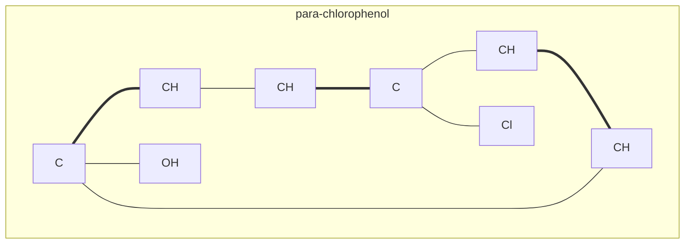

# MoleCode — Overview

> What MoleCode is, the problem it solves, and the grammar behind it.

## The problem: structure is implicit in SMILES

A molecule is a graph — atoms are nodes, bonds are edges, and chemical behavior emerges from the topology. But LLMs are usually given molecules as **linear strings** such as SMILES:

```
SMILES:  CC(=O)Oc1ccccc1C(=O)O      (aspirin)
```

In a string, the graph is **implicit**: connectivity is positional, branches are parentheses, and ring bonds are encoded as matching index digits (`c1...c1`). Before an LLM can reason about the molecule — count a substructure, predict a reaction, edit a group — it must first *mentally reconstruct the graph from the syntax*. That reconstruction burns reasoning budget and is exactly where models trip up, especially on large or unfamiliar molecules.

## The insight: make structure *be* the language

Instead of decoding structure from text, MoleCode writes the structure out explicitly. Every atom and every bond is a **typed declaration with a persistent identifier**, serialized as a [Mermaid](https://mermaid.js.org/) graph:



The connectivity is stated directly: `chlorophenol_C_4 --- chlorophenol_Cl_1` literally says "carbon 4 is single-bonded to a chlorine." The model operates **on** the structure rather than recovering it.

Crucially, MoleCode is **deterministically and losslessly inter-convertible with SMILES / MOL through RDKit** — no learned model, no information loss. You can move between MoleCode and your existing cheminformatics stack at will.

## The grammar: Subgraph → Node → Edge

One small grammar underlies every MoleCode domain:

- **Subgraph** — a scoped structural object: a molecule, a polymer repeat unit, a Markush scaffold, a reaction intermediate.
- **Node** — a typed entity with a persistent ID: an atom `[C]`, or a higher-level labelled entity such as a Markush abbreviation `{R1}`.
- **Edge** — an explicit relation between nodes: for molecules, a bond whose order is encoded directly in the operator (`---`, `===`, `-.-`).

Because the same three primitives express atoms, repeat units, and variable groups, MoleCode spans three domains with one syntax:

| Domain | Module | Adds |
| --- | --- | --- |
| Small molecules | [`molecode.molecule`](../molecode/molecule) | atoms, bonds, stereochemistry |
| Polymers | [`molecode.polymer`](../molecode/polymer) | explicit repeat unit + `×n`, `TL`/`TR` termini |
| Markush | [`molecode.markush`](../molecode/markush) | `{}` abbreviation nodes for R-groups |

## What you can do with it

MoleCode is a drop-in representation for any LLM, enabling four task families — **understanding, generation, editing, and reasoning** (see [05-tasks.md](05-tasks.md)). Because the model's output *is* a graph, you can parse and validate it deterministically with RDKit instead of fighting fragile string post-processing.

## Next

- [02-syntax.md](02-syntax.md) — the full Mermaid grammar
- [03-polymers.md](03-polymers.md) — polymers
- [04-markush.md](04-markush.md) — Markush structures
- [05-tasks.md](05-tasks.md) — the four LLM task families
- [06-why-it-works.md](06-why-it-works.md) — the empirical evidence
