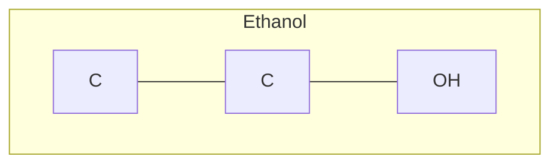

# MoleCode — Syntax reference (small molecules)

> The Mermaid grammar for atoms, bonds, stereochemistry, and subgraphs.

A MoleCode document is a Mermaid graph. The authoritative, LLM-readable
specification lives in [`molecode.prompts.MOLECULE_SYSTEM_PROMPT`](../molecode/prompts);
this page is the human summary.

## Document structure



- `graph TB` (top-bottom) or `graph LR` (left-right) opens the document.
- A `subgraph ID["display name"]` … `end` block scopes one structural object. A
  molecule may be a single subgraph or split into several chemically meaningful
  subgraphs; bonds can cross subgraph boundaries.
- `%%` begins a comment — ignored by the parser, used to attach reasoning and
  validation notes inline.

## Atom nodes

Format: **`prefix_Element_Number[DisplayLabel]`**

```
chlorophenol_C_1[C]      ethanol_O_2[OH]      Mol_N_3[NH2]
```

- `prefix` — a namespace (usually the molecule/subgraph name) that keeps IDs
  unique and stable across prompt → reasoning → output.
- `Element_Number` — element symbol plus a per-element counter, giving each atom
  a **persistent identifier** (`C_1`, `C_2`, …).
- `[DisplayLabel]` — element + explicit hydrogen count + formal charge:

| Label | Meaning | Label | Meaning |
| --- | --- | --- | --- |
| `[CH3]` | carbon, 3 H | `[N(+)]` | nitrogen, +1 |
| `[CH2]` | carbon, 2 H | `[O(-)]` | oxygen, −1 |
| `[CH]` | carbon, 1 H | `[NH3(+)]` | ammonium |
| `[C]` | carbon, 0 H | `[O(2-)]` | oxide, −2 |
| `[OH]`, `[NH2]` | … | … | … |

> Because hydrogen counts are **explicit**, a local edit must keep them
> consistent: grafting a bond onto a `[CH3]` carbon turns it into `[CH2]`
> (see [`examples/06_editing.py`](../examples/06_editing.py)).

## Bond (edge) operators

| Operator | Bond | RDKit |
| --- | --- | --- |
| `---` | single | `SINGLE` |
| `===` | double | `DOUBLE` |
| `-.-` | triple | `TRIPLE` |
| `-->` | dative / coordinate | `DATIVE` (metal complexes) |
| `<-->` | aromatic | `AROMATIC` |

```
Acetylene_C_1 -.- Acetylene_C_2        %% triple bond
```

## Aromatic rings — Kekulé form

Aromatic rings are written in **Kekulé form** (explicit alternating single/double
bonds) for small molecules, so the topology stays unambiguous:

```
chlorophenol_C_1 === chlorophenol_C_2
chlorophenol_C_2 --- chlorophenol_C_3
chlorophenol_C_3 === chlorophenol_C_4
...
```

## Stereochemistry

- **Double-bond E/Z** — annotate the double bond:

  ```
  EB_C2 ===|E| EB_C3        %% also ===|Z|
  ```

- **Chirality R/S** — suffix the atom ID:

  ```
  R2butanol_C_2_R[CH]       %% _R or _S
  ```

## Round-tripping in code

```python
from rdkit import Chem
from molecode.molecule import mol_to_mermaid, mermaid_to_mol, mol_to_smiles

graph = mol_to_mermaid(Chem.MolFromSmiles("CCO"), name="Ethanol")
mol   = mermaid_to_mol(graph)          # strict=True rejects unknown atoms
mol_to_smiles(mol)                     # -> 'CCO'
```

Next: [03-polymers.md](03-polymers.md) · [04-markush.md](04-markush.md)
