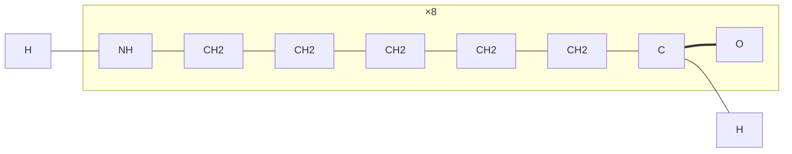

# MoleCode — Polymers

> Represent a polymer by its explicit repeat unit plus a symbolic `×n` count.

## The idea

A polymer has, in principle, an enormous number of atoms. Expanding the whole
chain as one SMILES string is hopeless for an LLM — accuracy collapses toward
**0%** as the chain grows (see [06-why-it-works.md](06-why-it-works.md)).
Polymer-specific SMILES (PSMILES) instead writes one repeat unit with two `*`
attachment points, e.g. `*NCCCCCC(=O)*` for Nylon-6 — but the connectivity is
still implicit.

MoleCode keeps the repeat unit **explicit as a subgraph** and carries the
repetition count **symbolically** in the subgraph label `×n`, with two terminus
markers `TL` / `TR` corresponding to the two `*` attachment atoms. The graph stays
small no matter how long the chain is.

## Nylon-6 (`*NCCCCCC(=O)*`, repeat ×8)



- `subgraph B0["×8"]` — the repeat unit, repeated 8 times. The `×8` is symbolic;
  the internal atoms and bonds stay fully explicit.
- `TL` / `TR` — the left/right chain termini. `TL --- B0_N1` marks the entry
  attachment (first `*`); `B0_C6 --- TR` marks the exit (second `*`).
- Atom labels and bond operators are identical to the
  [small-molecule grammar](02-syntax.md). Hydrogen counts are inferred from
  valence during reverse conversion.

## Usage

```python
from molecode.polymer import polymer_to_mermaid, mermaid_to_psmiles

graph = polymer_to_mermaid("*NCCCCCC(=O)*", n=8, name="Nylon-6")  # PSMILES -> graph
psmiles = mermaid_to_psmiles(graph)                               # graph -> '*NCCCCCC(=O)*'
```

Each block's SMILES must contain exactly two `*` attachment points (first `*` =
left/entry, second `*` = right/exit).

## Stereochemistry

The repeat unit's stereochemistry is preserved across the round trip, using the
same conventions as the [small-molecule grammar](02-syntax.md):

- **Tetrahedral chirality** — atoms carry an absolute CIP suffix `_R` / `_S` on
  their id (e.g. a poly(lactic acid) stereocentre `B0_C2_R`). The label is the
  absolute CIP configuration, not RDKit's order-dependent CW/CCW tag.
- **Double-bond geometry** — `===|E|` / `===|Z|` on the double bond (e.g.
  *trans*- vs *cis*-polybutadiene).

```python
from rdkit import Chem
from molecode.polymer import polymer_to_mermaid, mermaid_to_psmiles

# cis vs trans are kept distinct through the round trip
trans = mermaid_to_psmiles(polymer_to_mermaid("*C/C=C/C*", n=10))   # -> '*C/C=C/C*'
cis   = mermaid_to_psmiles(polymer_to_mermaid("*C/C=C\\C*", n=10))  # -> '*C/C=C\\C*'
assert Chem.CanonSmiles(trans) != Chem.CanonSmiles(cis)
```

## Block copolymers

A copolymer is one subgraph per block, in order:

```python
from molecode.polymer import block_copolymer_to_mermaid, BlockSpec

graph = block_copolymer_to_mermaid(
    [BlockSpec("*CCO*",    n=20, label="PEG"),
     BlockSpec("*CC(C)O*", n=10, label="PPO")],
    name="PEG-b-PPO",
)
```

This produces consecutive `B0["×20"]`, `B1["×10"]` subgraphs joined
`B0_exit --- B1_entry`, with `TL`/`TR` on the outer ends.

See [`examples/02_polymer_roundtrip.py`](../examples/02_polymer_roundtrip.py) for
homopolymers and a block copolymer end to end.

Next: [04-markush.md](04-markush.md)
