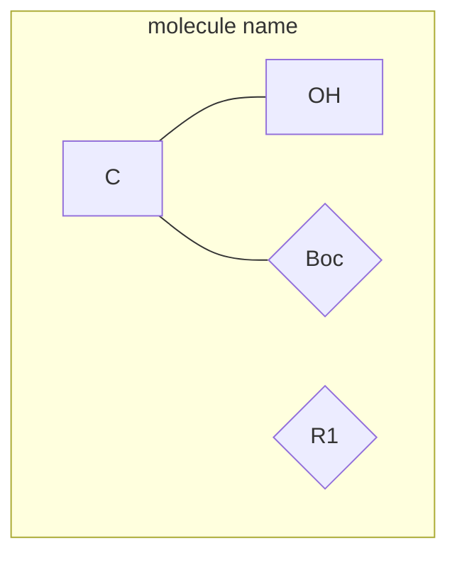

# MoleCode — Markush structures

> Variable R-groups and named substituents as first-class abbreviation nodes.

## The idea

A **Markush structure** is a generic/scaffold structure with variable parts:
R-groups (`R1`, `R2`, …), attachment points, alternative groups, and named
abbreviations (`Boc`, `Ph`, `Ar`). SMILES has no syntax for "this position is a
variable group" — so Markush is exactly where string representations break down.

MoleCode adds one thing to the [molecular grammar](02-syntax.md): an
**abbreviation node** written with **curly braces** `{label}`, sitting alongside
ordinary square-bracket atom nodes `[label]`.



- `Mol_C_1[C]` — an ordinary **atom node**.
- `Mol_X_1{Boc}` — an **abbreviation node**: a named group left unexpanded.
- `Mol_X_2{R1}` — a **variable group** with no fixed structure.

**Rule:** each `{...}` is exactly one chemically meaningful abbreviation. A
composite label such as `NHBoc` is decomposed into an atom node plus an
abbreviation node:

```
Mol_N_1[NH] --- Mol_X_1{Boc}
```

Common abbreviations: `{Me}`, `{Et}`, `{Ph}`, `{Bn}`, `{Boc}`, `{Cbz}`, `{Ts}`,
`{NO2}`, `{COOH}`, `{CF3}`, `{OMe}`, `{TMS}`, `{tBu}`, `{iPr}`; variable groups:
`{R}`, `{R1}`…`{R17}`, `{Ar}`, `{X}`, `{Y}`, `{Z}`, `{Alkyl}`, `{(CH2)n}`.

## Parsing

```python
from molecode.markush import mermaid_to_mol, mol_to_smiles

mol = mermaid_to_mol(markush_text, strict=False)   # abbreviations -> '*' placeholders
mol_to_smiles(mol)
```

Use `strict=False` so abbreviation nodes survive as dummy (`*`) atoms instead of
being rejected.

## Abbreviation map

[`molecode.markush.abbreviation_map`](../molecode/markush/abbreviation_map.py)
defines how abbreviations expand to structure:

- `SINGLE_ATOM_MAP` — abbreviation ≡ one atom label (`"Me" → "CH3"`).
- `SUBGRAPH_MAP` — abbreviation → a multi-atom subgraph with an `attach` atom
  (`Boc → OC(=O)C(C)(C)C`).
- `NON_EXPANDABLE` — variable groups with no unique expansion (`R`, `Ar`, `X`, …),
  matched by name only.
- `EXPAND_MAP = build_expand_map()` — the combined lookup used for comparison.

## Graph-isomorphism comparison (no RDKit)

[`molecode.markush.graph`](../molecode/markush/graph.py) compares two
Markush graphs **up to abbreviation expansion and Kekulé ambiguity** — the right
notion of "same structure" for scoring model predictions:

```python
from molecode.markush import MoleCodeGraph, molecode_isomorphic, EXPAND_MAP

g1 = MoleCodeGraph.from_text(pred_text)
g2 = MoleCodeGraph.from_text(gold_text)
same, details = molecode_isomorphic(g1, g2, abbrev_expand_map=EXPAND_MAP)
# details["reason"] -> "isomorphic" | "isomorphic after expansion" | ...
```

`molecode_isomorphic`:

- treats `[OH]` (atom) and `{OH}` (abbrev) with the same label as equal;
- treats Kekulé-alternating ring bonds (`===`/`---`) as interchangeable;
- if a direct match fails, **expands abbreviations on both sides** via
  `EXPAND_MAP` and retries — so `{Boc}` matches a fully-drawn t-butyl carbamate,
  and `{Me}` matches `{CH3}`.

`normalize_abbrev_name` canonicalizes spellings first (`R₁`→`R1`, `OCH3`→`OMe`,
`CO2H`→`COOH`, case-folding, …).

See [`examples/03_markush_roundtrip.py`](../examples/03_markush_roundtrip.py).

Next: [05-tasks.md](05-tasks.md)
